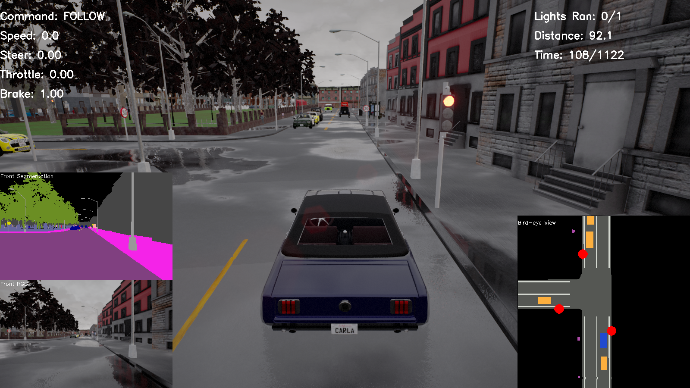

# DI-drive


[](https://twitter.com/opendilab)


[](https://github.com/opendilab/DI-drive/stargazers)
[](https://github.com/opendilab/DI-drive/network)

[](https://github.com/opendilab/DI-drive/blob/master/LICENSE)

## Introduction

[DI-drive doc](https://opendilab.github.io/DI-drive/)

**DI-drive** is an open-source Decision Intelligence Platform for Autonomous Driving simulation. DI-drive applies different simulators/datasets/cases in **Decision Intelligence** Training & Testing for **Autonomous Driving** Policy.
It aims to

- run Imitation Learning, Reinforcement Learning, GAIL etc. in a single platform and simple unified entry
- apply Decision Intelligence in any part of the driving simulation
- suit most of the driving simulators input & output
- run designed driving cases and scenarios

and most importantly, to **put these all together!**

**DI-drive** uses [DI-engine](https://github.com/opendilab/DI-engine), a Reinforcement Learning
platform to build most of the running modules and demos. **DI-drive** currently supports [Carla](http://carla.org),
an open-source Autonomous Driving simulator to operate driving simulation, and [MetaDrive](https://decisionforce.github.io/metadrive/),
a diverse driving scenarios for Generalizable Reinforcement Learning. DI-drive is an application platform under [OpenDILab](http://opendilab.org/)


<p align="center"> Visualization of Carla driving in DI-drive </p>

## Outline

 * [Introduction](#introduction)
 * [Outline](#outline)
 * [Installation](#installation)
 * [Quick Start](#quick-start)
 * [Model Zoo](#model-zoo)
 * [Casezoo](#di-drive-casezoo)
 * [File Structure](#file-structure)
 * [Contributing](#contributing)
 * [License](#license)
 * [Citation](#citation)

## Installation

**DI-drive** runs with **Python >= 3.5** and **DI-engine >= 0.3.1** (Pytorch is needed in DI-engine). You can install DI-drive from the source code:

```bash
git clone https://gitlab.bj.sensetime.com/open-XLab/cell/xad.git
cd xad
pip install -e .
```

DI-engine and Pytorch will be installed automatically.

In addition, at least one simulator in Carla and MetaDrive need to be able to run in DI-drive. [MetaDrive](https://decisionforce.github.io/metadrive/) can be easily installed via `pip`.
If [Carla](http://carla.org) server is used for simulation, users need to install 'Carla Python API' in addition. You can use either one of them or both. Make sure to modify the activated simulators in `core.__init__.py` to avoid import error.

Please refer to the [installation guide](https://opendilab.github.io/DI-drive/installation/index.html) for details about the installation of **DI-drive**.

## Quick Start

### Carla

Users can check the installation of Carla and watch the visualization by running an 'auto' policy in provided town map. You need to start a Carla server first and modify the Carla host and port in `auto_run.py` into yours. Then run:

```bash
cd demo/auto_run
python auto_run.py
```

### MetaDrive

After installation of MetaDrive, you can start an RL training in MetaDrive Macro Environment by running the following code:

```bash
cd demo/metadrive
python macro_env_dqn_train.py.
```

We provide detail guidance for IL and RL experiments in all simulators and quick run of existing policy for beginners in our [documentation](https://opendilab.github.io/DI-drive/). Please refer to it if you have further questions.

## Model Zoo

### Imitation Learning

- [Conditional Imitation Learning](https://arxiv.org/abs/1710.02410)
- [Learning by Cheating](https://arxiv.org/abs/1912.12294)
- [from Continuous Intention to Continuous Trajectory](https://arxiv.org/abs/2010.10393)

### Reinforcement Learning

- BeV Speed RL
- [Implicit Affordance](https://arxiv.org/abs/1911.10868)
- [Latent DRL](https://arxiv.org/abs/2001.08726)
- MetaDrive Macro RL

## DI-drive Casezoo

**DI-drive Casezoo** is a scenario set for training and testing the Autonomous Driving policy in simulator.
**Casezoo** combines data collected from actual vehicles and Shanghai Lingang road license test Scenarios.
**Casezoo** supports both evaluating and training, which makes the simulation closer to real driving.

Please see [casezoo instruction](docs/casezoo_instruction.md) for details about **Casezoo**.

## File Structure

```
DI-drive
|-- .gitignore
|-- .style.yapf
|-- CHANGELOG
|-- LICENSE
|-- README.md
|-- format.sh
|-- setup.py
|-- core
|   |-- data
|   |   |-- base_collector.py
|   |   |-- benchmark_dataset_saver.py
|   |   |-- bev_vae_dataset.py
|   |   |-- carla_benchmark_collector.py
|   |   |-- cict_dataset.py
|   |   |-- cilrs_dataset.py
|   |   |-- lbc_dataset.py
|   |   |-- benchmark
|   |   |-- casezoo
|   |   |-- srunner
|   |-- envs
|   |   |-- base_drive_env.py
|   |   |-- drive_env_wrapper.py
|   |   |-- md_macro_env.py
|   |   |-- md_traj_env.py
|   |   |-- scenario_carla_env.py
|   |   |-- simple_carla_env.py
|   |-- eval
|   |   |-- base_evaluator.py
|   |   |-- carla_benchmark_evaluator.py
|   |   |-- serial_evaluator.py
|   |   |-- single_carla_evaluator.py
|   |-- models
|   |   |-- bev_speed_model.py
|   |   |-- cilrs_model.py
|   |   |-- common_model.py
|   |   |-- lbc_model.py
|   |   |-- model_wrappers.py
|   |   |-- mpc_controller.py
|   |   |-- pid_controller.py
|   |   |-- vae_model.py
|   |   |-- vehicle_controller.py
|   |-- policy
|   |   |-- auto_policy.py
|   |   |-- base_carla_policy.py
|   |   |-- cilrs_policy.py
|   |   |-- lbc_policy.py
|   |-- simulators
|   |   |-- base_simulator.py
|   |   |-- carla_data_provider.py
|   |   |-- carla_scenario_simulator.py
|   |   |-- carla_simulator.py
|   |   |-- fake_simulator.py
|   |   |-- srunner
|   |-- utils
|       |-- data_utils
|       |-- env_utils
|       |-- learner_utils
|       |-- model_utils
|       |-- others
|       |-- planner
|       |-- simulator_utils
|-- demo
|   |-- auto_run
|   |-- cict
|   |-- cilrs
|   |-- implicit
|   |-- latent_rl
|   |-- lbc
|   |-- metadrive
|   |-- simple_rl
|-- docs
|   |-- casezoo_instruction.md
|   |-- figs
|   |-- source
```

## Join and Contribute

We appreciate all contributions to improve DI-drive, both algorithms and system designs. Welcome to OpenDILab community! Scan the QR code and add us on Wechat:

<div align=center></div>

Or you can contact us with [slack](https://opendilab.slack.com/join/shared_invite/zt-v9tmv4fp-nUBAQEH1_Kuyu_q4plBssQ#/shared-invite/email) or email (opendilab.contact@gmail.com).

## License

DI-engine released under the Apache 2.0 license.

## Citation

```latex
@misc{didrive,
    title={{DI-drive: OpenDILab} Decision Intelligence platform for Autonomous Driving simulation},
    author={DI-drive Contributors},
    publisher = {GitHub},
    howpublished = {\url{https://github.com/opendilab/DI-drive}},
    year={2021},
}
```
